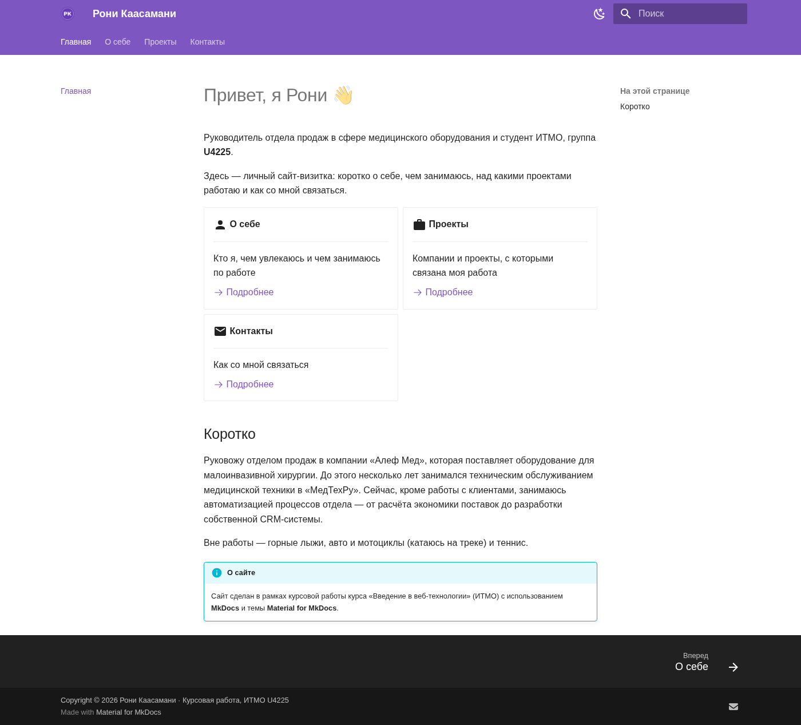
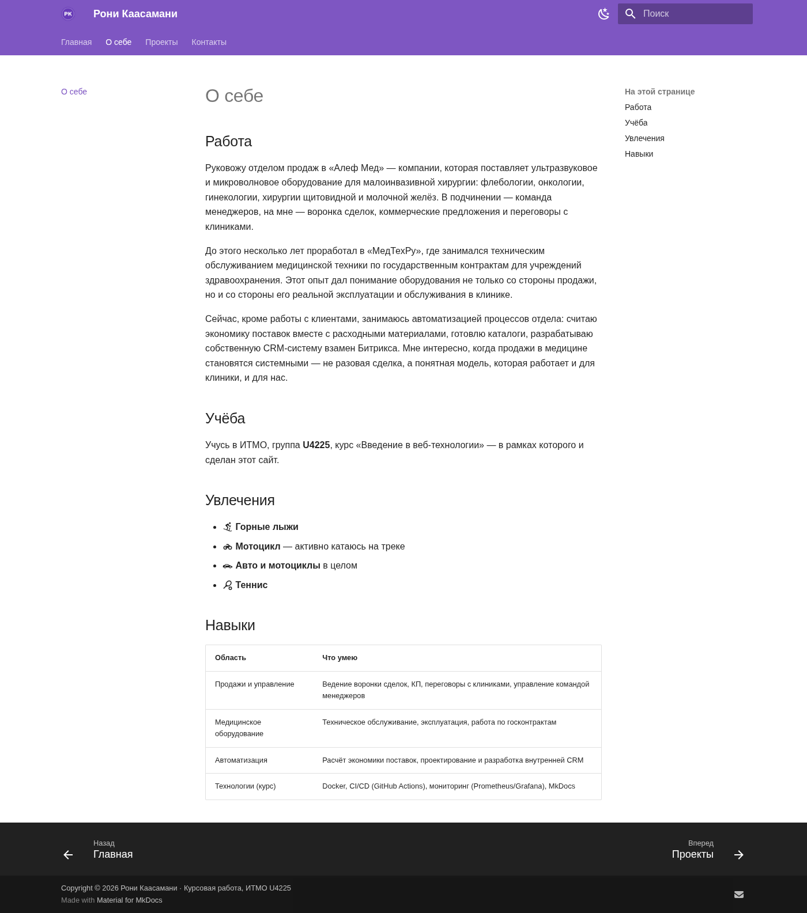
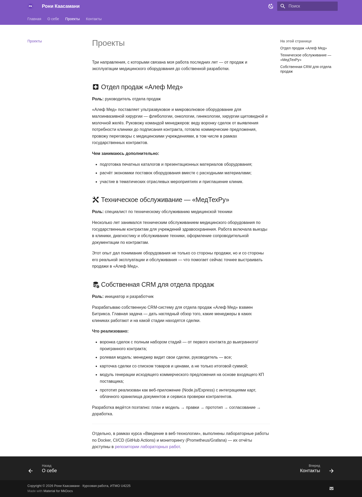
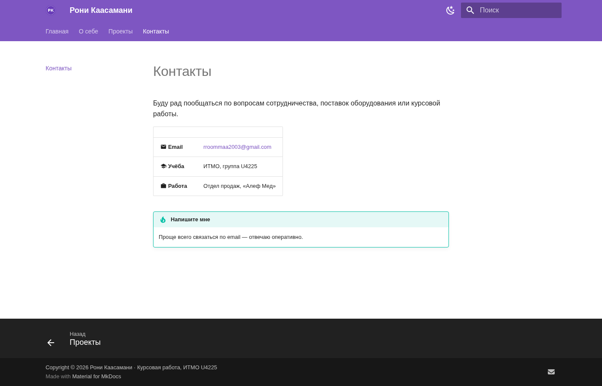
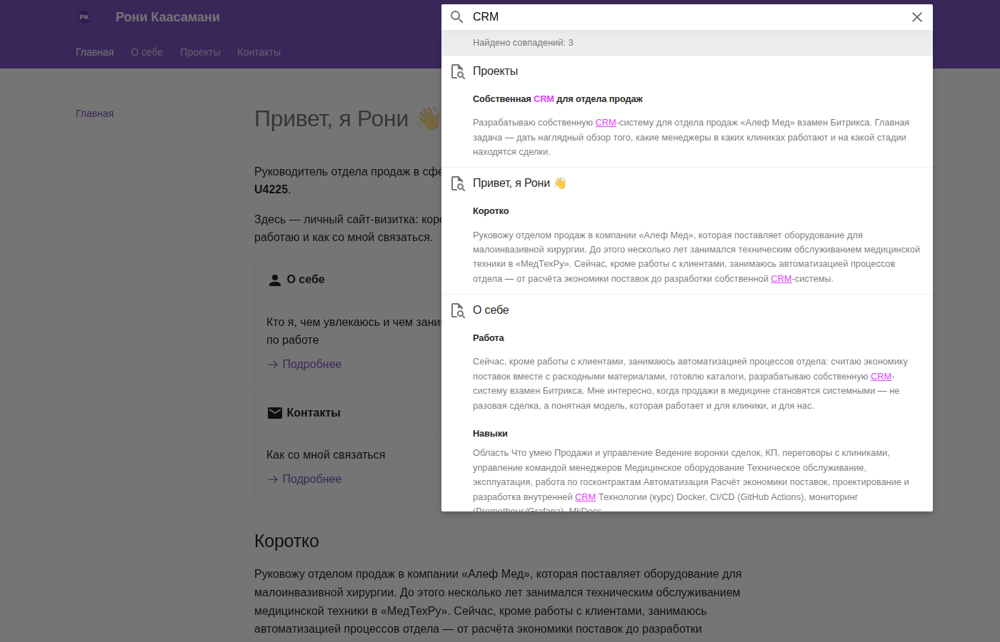

University: [ITMO University](https://itmo.ru/ru/)
Faculty: [FICT](https://fict.itmo.ru)
Course: Введение в веб-технологии
Year: 2025/2026
Group: U4225
Author: Каасамани Рони Бахааевич
Работа: Курсовая работа — персональный сайт на MkDocs
Date of create: 18.09.2026
Date of finished: 21.09.2026

# Курсовая работа. Персональный сайт на MkDocs

**Готовый сайт:** [https://zstookteam-cpu.github.io/devops-lab-kaasamani/](https://zstookteam-cpu.github.io/devops-lab-kaasamani/)

**Исходный код:** папка [`coursework/`](.) в этом репозитории

## Цель работы

Создать собственный персональный сайт с использованием технологии MkDocs, языка разметки Markdown и темы Material for MkDocs: минимум 4 страницы, рабочая навигация, поиск, настроенная цветовая схема и логотип, опубликованный на GitHub Pages.

## 1. Подготовка окружения

Проверена установка MkDocs и темы Material:

    pip show mkdocs mkdocs-material

При отсутствии — установка:

    pip install mkdocs mkdocs-material

## 2. Структура проекта

Создан проект со стандартной для MkDocs структурой внутри папки `coursework/`:

    coursework/
    ├── mkdocs.yml
    ├── coursework_report.md
    ├── screenshots/
    └── docs/
        ├── index.md        # Главная
        ├── about.md        # О себе
        ├── projects.md     # Проекты
        ├── contacts.md     # Контакты
        └── images/
            ├── logo.png
            └── favicon.png

Логотип и favicon сгенерированы программно (Python, Pillow) — круглый бейдж с инициалами в фирменном фиолетовом цвете сайта.


*Рисунок 1 — главная страница сайта: приветствие, карточки разделов, фиолетовая тема Material, логотип в шапке.*

## 3. Содержание страниц

Наполнены четыре обязательные страницы с использованием разных элементов Markdown — заголовков, списков, таблиц, ссылок, изображений, блоков `admonition` и карточек:

- **Главная** — приветствие, краткое summary и карточки-ссылки на остальные разделы;
- **О себе** — работа, учёба в ИТМО, увлечения, таблица навыков;
- **Проекты** — три примера из личного опыта;
- **Контакты** — email в виде таблицы и `mailto:`-ссылки.


*Рисунок 2 — страница «О себе» с таблицей навыков и списком увлечений (иконки Material).*


*Рисунок 3 — страница «Проекты» с тремя карточками-разделами.*


*Рисунок 4 — страница «Контакты» с email и информационным блоком (admonition).*

## 4. Конфигурация `mkdocs.yml`

Настроена тема Material: фиолетовая (`deep purple`) цветовая схема со светлым/тёмным режимом, логотип и favicon в шапке, вкладочная навигация (`navigation.tabs`), футер с копирайтом и ссылкой на почту, встроенный поиск на русском языке (`search.lang: ru`) и набор `markdown_extensions` (admonition, таблицы, подсветка кода, emoji-иконки Material).

```yaml
theme:
  name: material
  logo: images/logo.png
  favicon: images/favicon.png
  palette:
    - scheme: default
      primary: deep purple
      accent: purple
    - scheme: slate
      primary: deep purple
      accent: purple
  features:
    - navigation.tabs
    - navigation.top
    - navigation.footer
    - search.suggest
    - search.highlight

nav:
  - Главная: index.md
  - О себе: about.md
  - Проекты: projects.md
  - Контакты: contacts.md

plugins:
  - search:
      lang: ru
```

## 5. Сборка и проверка поиска

Сайт собран в строгом режиме, чтобы поймать все ошибки ссылок и конфигурации:

    mkdocs build --strict

Сборка прошла без единой ошибки или предупреждения о битых ссылках. Отдельно проверена работа встроенного поиска — запрос «CRM» находит совпадения сразу на трёх страницах сайта.


*Рисунок 5 — проверка встроенного поиска: запрос «CRM» находит совпадения на нескольких страницах.*

## 6. Публикация на GitHub Pages

Сайт опубликован стандартной для MkDocs командой, которая собирает проект и пушит его в ветку `gh-pages` репозитория:

    cd coursework
    mkdocs gh-deploy --force

После этого сайт стал доступен по адресу, указанному в начале отчёта. Публикация выполняется из ветки `gh-pages`, при этом исходники (папка `coursework/` с `mkdocs.yml` и `docs/`) остаются в ветке `main` вместе с остальными лабораторными работами.

## Результат

В ходе работы:

- создан MkDocs-проект с темой Material и четырьмя обязательными страницами (Главная, О себе, Проекты, Контакты);
- настроена рабочая навигация между разделами и функционирующий поиск по сайту;
- добавлены логотип и favicon в шапку, информация в футере, фиолетовая цветовая схема со светлым и тёмным режимом;
- использованы разные элементы Markdown: заголовки, списки, таблицы, ссылки, изображения, admonition-блоки, карточки;
- сборка проверена в строгом режиме (`mkdocs build --strict`) без ошибок;
- сайт опубликован на GitHub Pages командой `mkdocs gh-deploy`.

## Вывод

В ходе курсовой работы создан и опубликован персональный сайт на MkDocs с темой Material for MkDocs, отвечающий всем обязательным требованиям задания: четыре страницы с содержательным наполнением, настроенная навигация и поиск, оформленная цветовая схема, логотип и футер. Работа показала, как быстро и без знания HTML/CSS можно превратить структурированный Markdown-контент в полноценный современный сайт и опубликовать его на GitHub Pages.
