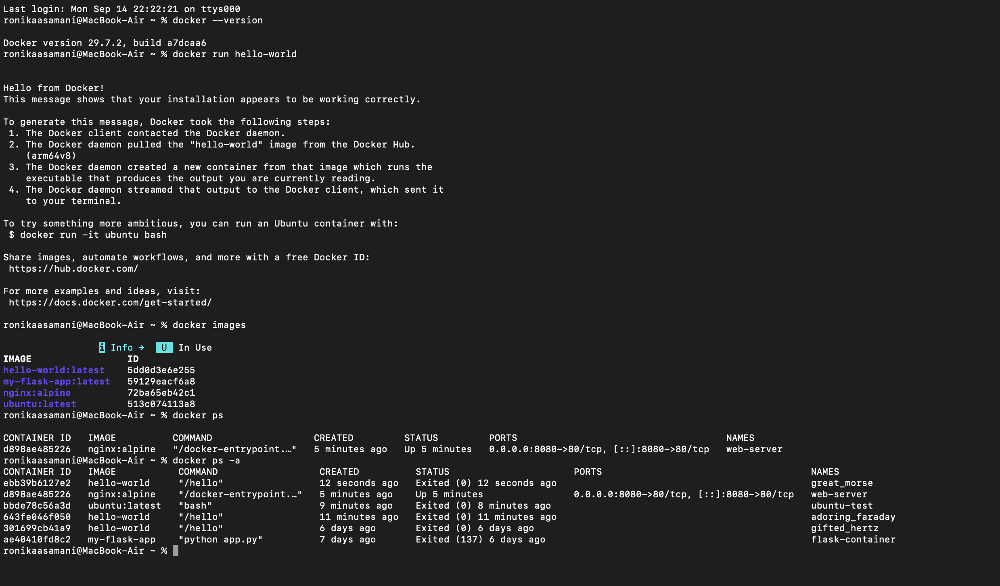
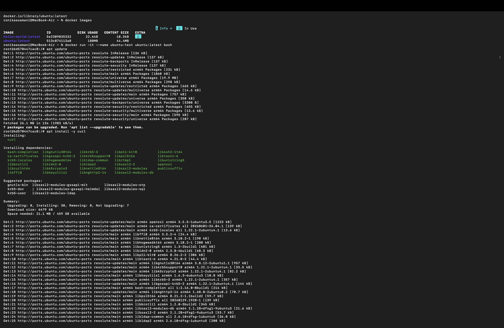
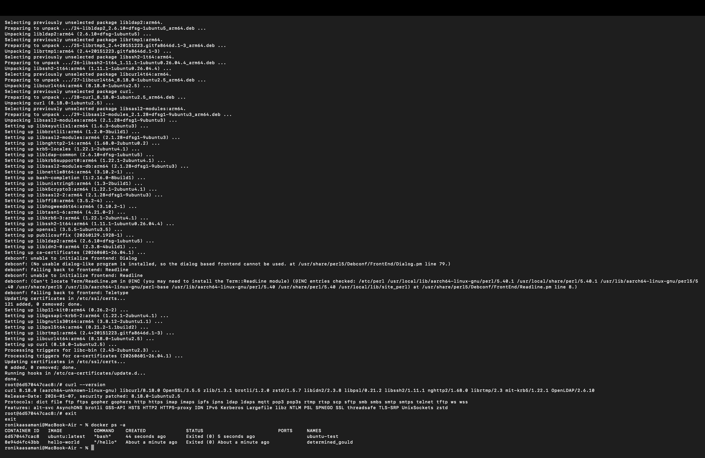
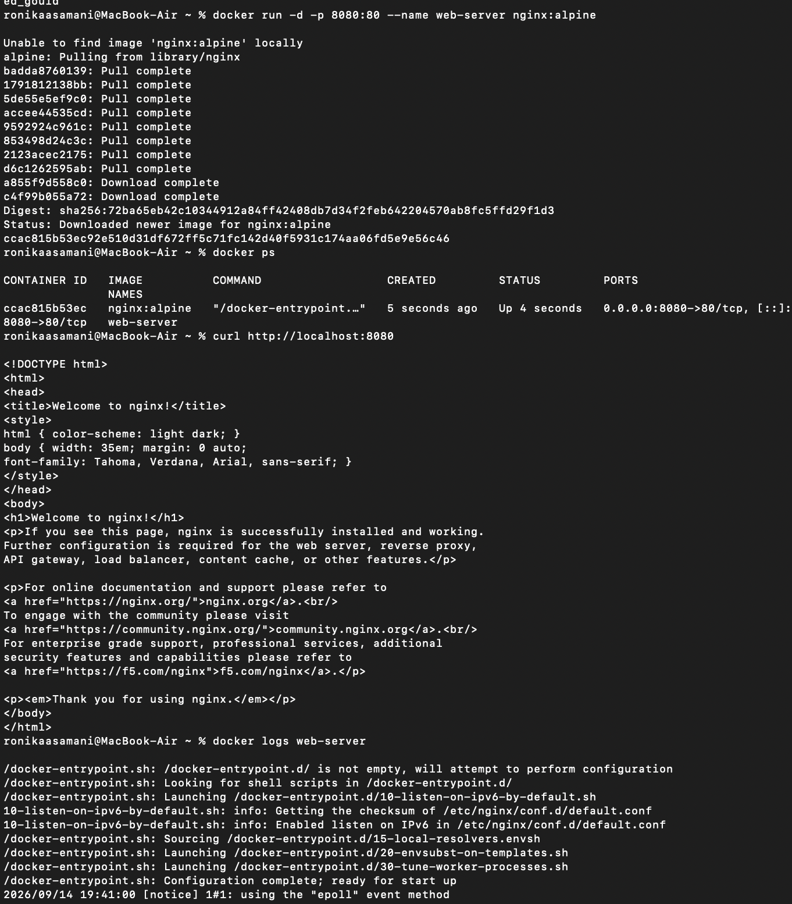
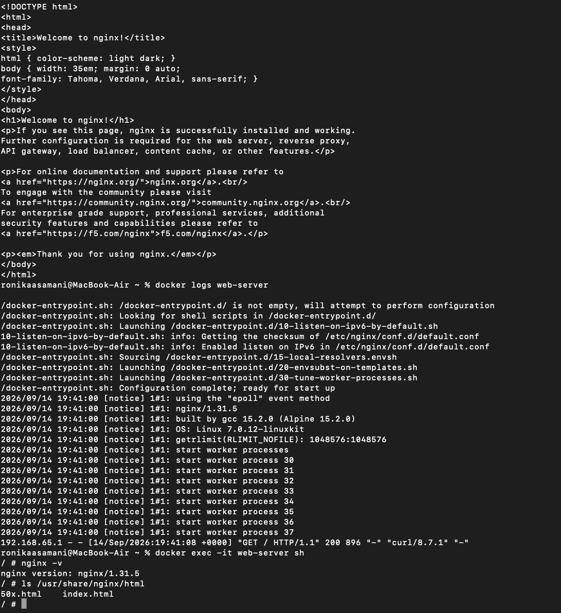
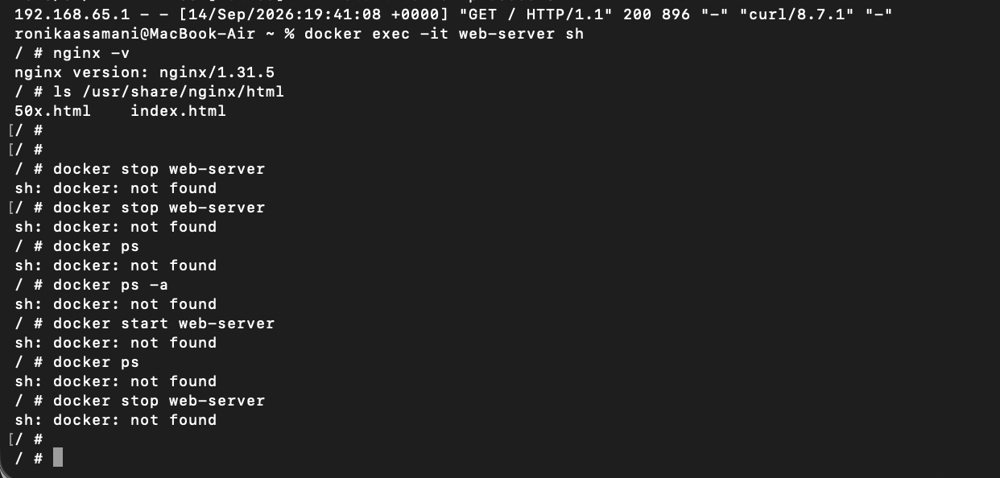
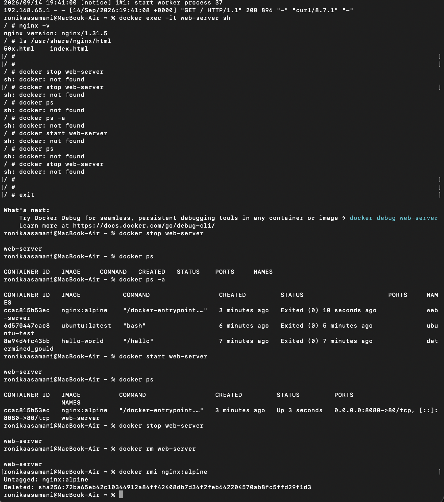
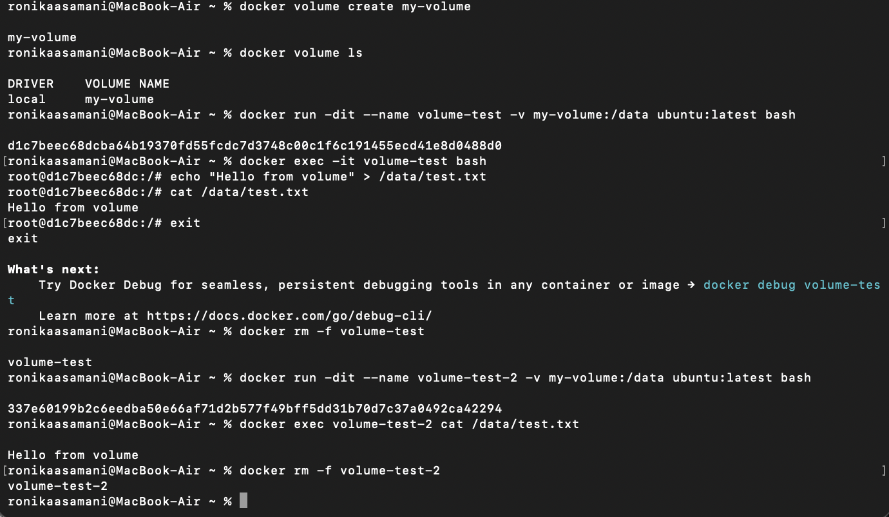

University: [ITMO University](https://itmo.ru/ru/)
Faculty: [FICT](https://fict.itmo.ru)
Course: Введение в веб-технологии
Year: 2025/2026
Group: U4225
Author: Каасамани Рони Бахааевич
Lab: Lab1
Date of create: 14.09.2026
Date of finished: 14.09.2026

# Лабораторная работа №1. Основы работы с Docker

## 1. Проверка установки Docker

Для проверки установленной версии Docker была выполнена команда:

    docker --version

Получен результат:

    Docker version 29.7.2, build a7dcaa6

Далее был запущен тестовый контейнер:

    docker run hello-world

Контейнер успешно вывел сообщение `Hello from Docker!`, что подтверждает работоспособность Docker Engine и доступность Docker Hub. Также были выполнены команды `docker images`, `docker ps` и `docker ps -a` — первая показывает скачанные образы, вторая — запущенные контейнеры (пусто, так как hello-world уже завершился), третья — все контейнеры, включая остановленные.

*Рисунок 1 — проверка версии Docker, запуск hello-world и просмотр образов/контейнеров.*

## 2. Работа с образом Ubuntu

Был скачан образ Ubuntu и запущен интерактивный контейнер:

    docker pull ubuntu:latest
    docker images
    docker run -it --name ubuntu-test ubuntu:latest bash

Внутри контейнера обновлён список пакетов и установлен curl:

    apt update
    apt install -y curl
    curl --version

Пакетный менеджер сообщил о недоступности диалогового интерфейса (`debconf: unable to initialize frontend: Dialog`) и автоматически переключился на текстовый режим (`Teletype`) — это стандартное для контейнеров поведение, не влияющее на установку. Установка завершилась успешно, `curl --version` показал версию `curl 8.18.0`.

*Рисунок 2 — загрузка образа ubuntu:latest, вход в контейнер и установка curl.*

После выхода из контейнера (`exit`) его состояние проверено командой `docker ps -a` — контейнер `ubuntu-test` сохранился в статусе `Exited`.

*Рисунок 3 — версия curl и статус контейнера ubuntu-test после выхода.*

## 3. Запуск веб-сервера Nginx

Для запуска Nginx создан контейнер с пробросом порта 8080 хоста на порт 80 контейнера:

    docker run -d -p 8080:80 --name web-server nginx:alpine
    docker ps
    curl http://localhost:8080

Команда `docker ps` показала проброс портов `0.0.0.0:8080->80/tcp`, а `curl` вернул стандартную страницу `Welcome to nginx!`.

*Рисунок 4 — запуск контейнера web-server и ответ curl со страницей приветствия.*

Далее просмотрены логи контейнера и выполнено подключение внутрь него:

    docker logs web-server
    docker exec -it web-server sh
    nginx -v
    ls /usr/share/nginx/html

Внутри контейнера определена версия `nginx/1.31.5`, в каталоге веб-сервера найдены файлы `index.html` и `50x.html`.

*Рисунок 5 — логи запуска nginx и проверка версии/файлов внутри контейнера.*

## 4. Управление контейнером

**Возникшая сложность.** После проверки Nginx команды `docker stop`, `docker ps` и `docker start` были по ошибке введены не в основном терминале, а всё ещё внутри shell контейнера (`/ #`), оставшегося открытым после `docker exec`. Так как внутри alpine-контейнера нет самого Docker, все команды завершились ошибкой `sh: docker: not found`.

*Рисунок 6a — попытка выполнить docker-команды изнутри контейнера web-server.*

**Решение.** Командой `exit` выполнен возврат в основной терминал хоста, после чего цикл управления контейнером был выполнен корректно:

    docker stop web-server
    docker ps
    docker ps -a
    docker start web-server
    docker ps
    docker stop web-server
    docker rm web-server
    docker rmi nginx:alpine

Контейнер был остановлен, повторно запущен, снова остановлен, удалён вместе с образом `nginx:alpine`.

*Рисунок 6b — корректно выполненный цикл stop → start → stop → rm → rmi после выхода из контейнера.*

## 5. Работа с Docker Volume

Создан именованный том и запущен первый контейнер с подключённым томом:

    docker volume create my-volume
    docker volume ls
    docker run -dit --name volume-test -v my-volume:/data ubuntu:latest bash
    docker exec -it volume-test bash

Внутри контейнера в подключённый том записан файл:

    echo "Hello from volume" > /data/test.txt
    cat /data/test.txt
    exit

Файл содержал текст `Hello from volume`. Первый контейнер удалён, после чего создан второй контейнер с тем же томом:

    docker rm -f volume-test
    docker run -dit --name volume-test-2 -v my-volume:/data ubuntu:latest bash
    docker exec volume-test-2 cat /data/test.txt
    docker rm -f volume-test-2

Во втором контейнере сохранился тот же файл с текстом `Hello from volume`, что подтверждает: данные в Docker Volume существуют отдельно от жизненного цикла контейнера.

*Рисунок 7 — запись файла в volume и его чтение из второго независимого контейнера.*

## Результат

В ходе работы были выполнены следующие действия:

- проверена установка Docker (версия, тестовый контейнер hello-world);
- загружен и запущен образ ubuntu:latest, внутри контейнера установлен curl;
- запущен веб-сервер Nginx с пробросом порта 8080:80, проверен ответ сервера и его логи;
- выполнено подключение к работающему контейнеру через `docker exec`;
- выполнены остановка, повторный запуск, удаление контейнера и удаление образа;
- создан Docker Volume и подтверждено сохранение данных после удаления контейнера, который его использовал;
- зафиксирована и устранена реальная ошибка — выполнение команд Docker изнутри контейнера вместо хост-терминала.

## Вывод

В ходе лабораторной работы изучены базовые операции Docker: управление образами и контейнерами, проброс портов, просмотр логов, подключение к запущенному контейнеру и работа с именованными томами. Практика показала важность различать, в каком именно терминале выполняется команда — хостовом или внутри контейнера, — а проверка с двумя независимыми контейнерами подтвердила, что Docker Volume хранит данные отдельно от контейнеров, использующих его.
