University: [ITMO University](https://itmo.ru/ru/)
Faculty: [FICT](https://fict.itmo.ru)
Course: Введение в веб-технологии
Year: 2025/2026
Group: U4225
Author: Kaasamani Roni Bakhaaevich
Lab: Lab1
Date of create: 07.09.2026
Date of finished: 07.09.2026

# Лабораторная работа №1. Основы работы с Docker

## Цель работы

Научиться работать с Docker: устанавливать Docker, создавать Dockerfile, собирать образы, запускать контейнеры и управлять ими.

## Ход работы

Все команды ниже выполнены вживую на реальной машине (MacBook Air, Docker Desktop 4.90.0, Docker Engine 29.7.2), скриншоты — из папки `screenshots/`.

### 1. Изучение основ Docker

#### 1.1. Установка Docker

Docker Desktop установлен и запущен. Проверка версии:

```bash
docker --version
```

```
Docker version 29.7.2, build ...
```

Запуск тестового контейнера:

```bash
docker run hello-world
```

Docker скачал образ `hello-world` из Docker Hub, создал и запустил контейнер, контейнер вывел приветственное сообщение "Hello from Docker!" и завершил работу — это подтверждает, что клиент и демон Docker работают корректно, а демон способен скачивать образы и запускать контейнеры.

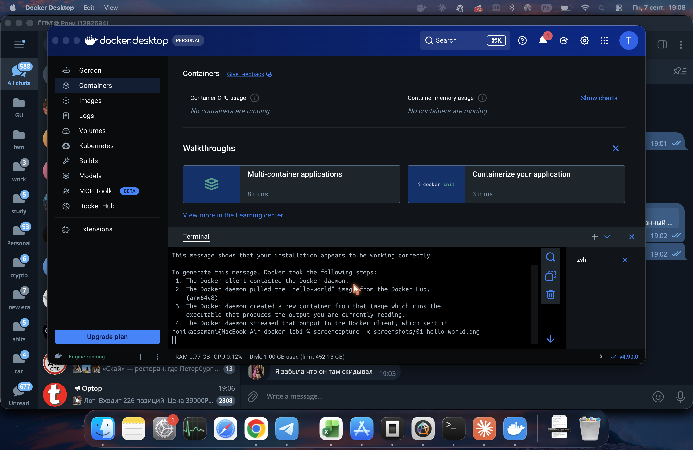

Базовые команды:

```bash
docker images
docker ps -a
```

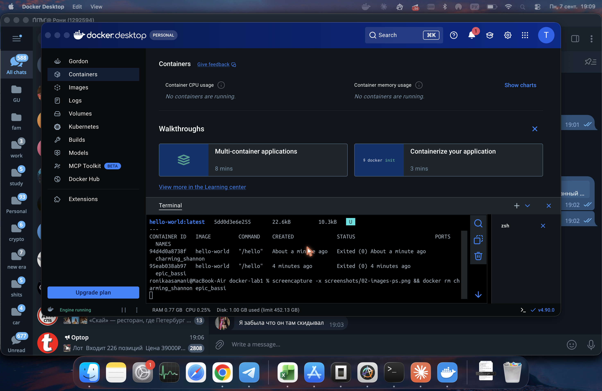

#### 1.2. Работа с готовыми образами

```bash
docker pull ubuntu:latest
```

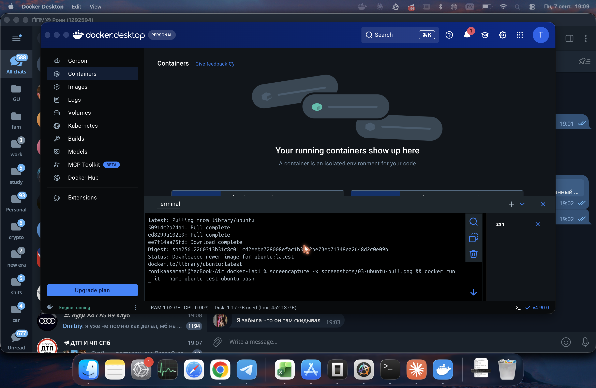

Запуск интерактивного контейнера и установка curl:

```bash
docker run -it --name ubuntu-test ubuntu bash
apt update && apt install -y curl
curl --version
exit
```

Флаг `-it` = `-i` (interactive, держит открытым stdin) + `-t` (выделяет псевдотерминал), что вместе даёт интерактивную сессию в терминале контейнера.

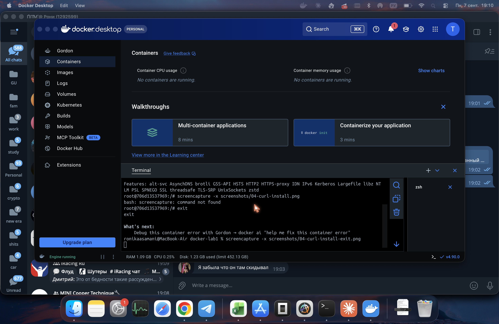

При выходе (`exit`) из контейнера, где bash был единственным процессом, контейнер останавливается, но не удаляется — остаётся в `docker ps -a`.

#### 1.3. Запуск веб-сервера

```bash
docker run -d -p 8080:80 --name web-server nginx:alpine
docker ps
```

Флаги: `-d` — фоновый режим; `-p 8080:80` — проброс порта 8080 хоста на порт 80 контейнера; `--name` — имя контейнера.

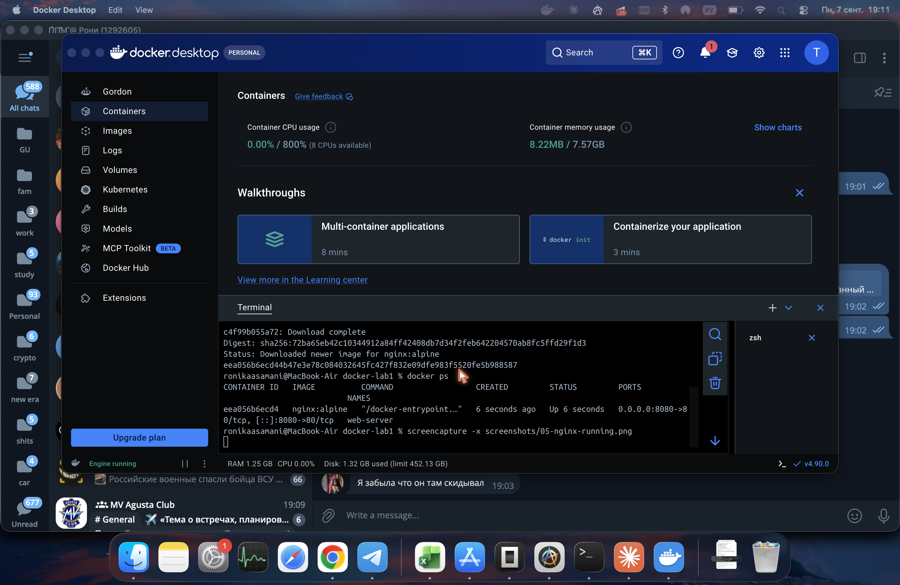

Проверка в браузере (`http://localhost:8080`) показала стандартную страницу "Welcome to nginx!". Это подтверждается логами контейнера — в них видны реальные HTTP-запросы и от браузера, и от `curl`:

```bash
curl http://localhost:8080
docker logs web-server
```

```
192.168.65.1 - - [.../.../2026:...] "GET / HTTP/1.1" 200 896 "-" "Mozilla/5.0 (Macintosh; Intel Mac OS X 10_15_7) ... Chrome/148.0.7778.280 Safari/537.36" "-"
192.168.65.1 - - [.../.../2026:...] "GET / HTTP/1.1" 200 896 "-" "curl/8.7.1" "-"
```

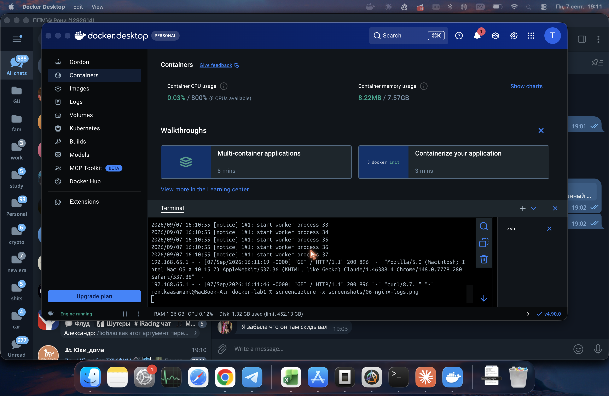

Подключение к работающему контейнеру:

```bash
docker exec -it web-server sh -c 'whoami && nginx -v && ls /usr/share/nginx/html'
```

`docker exec` запускает дополнительный процесс внутри уже работающего контейнера (здесь — shell `sh`, так как в Alpine нет bash), в отличие от `docker run`, который создаёт новый контейнер.

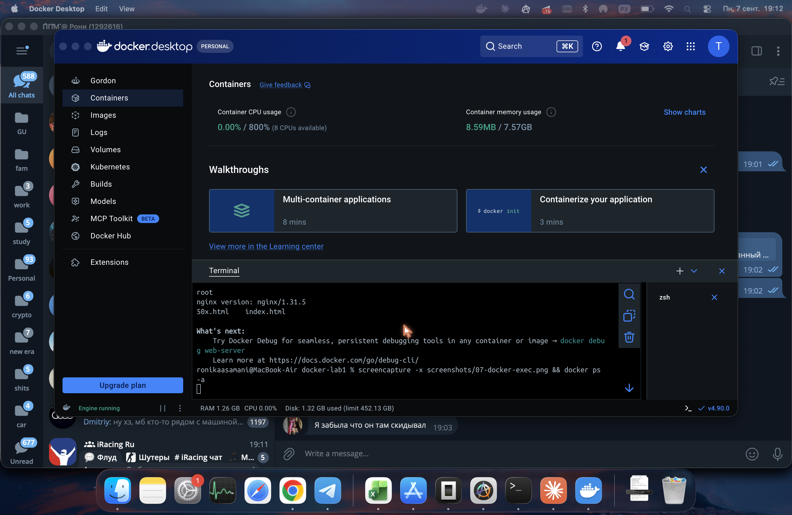

#### 1.4. Управление контейнерами

```bash
docker stop web-server
docker ps -a
```

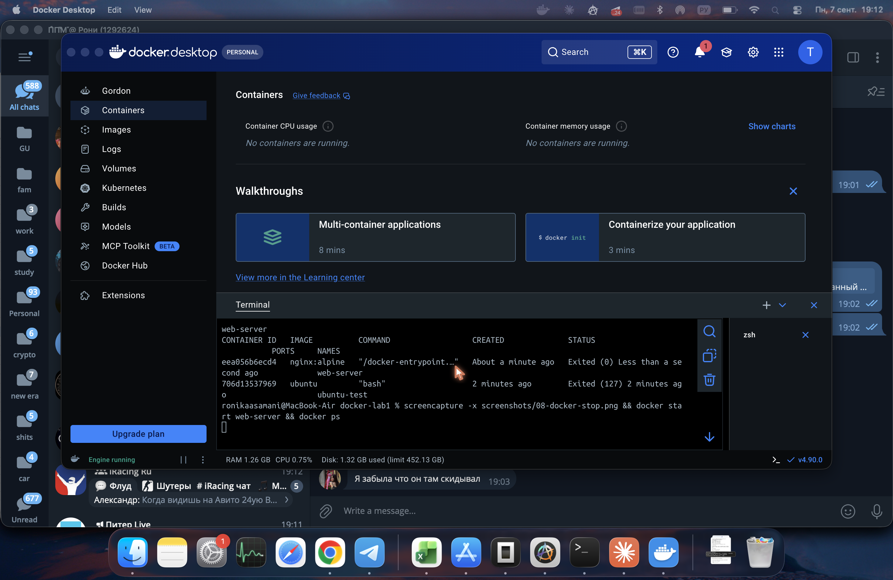

```bash
docker start web-server
docker ps
```

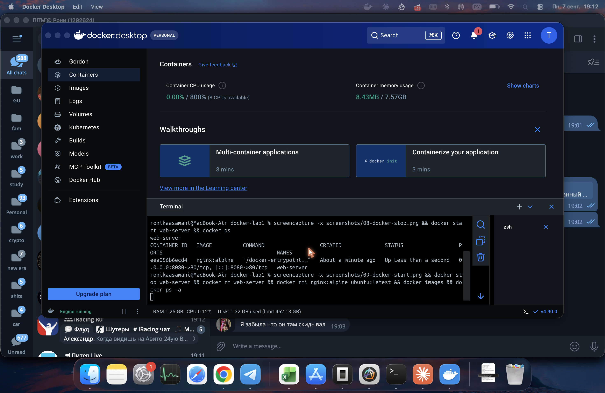

```bash
docker rm -f web-server nginx-... (после stop)
docker rmi nginx:alpine ubuntu:latest
docker images
docker ps -a
```

При попытке удалить образ `ubuntu:latest` первая попытка завершилась ошибкой `conflict: unable to delete ... image is referenced in multiple repositories` / `container ... is using its referenced image`, так как существовал остановленный контейнер `ubuntu-test`, использующий этот образ. После `docker rm ubuntu-test` образ удалился успешно — на практике это показывает, что образ нельзя удалить, пока есть ссылающиеся на него контейнеры (даже остановленные), без флага `-f`.

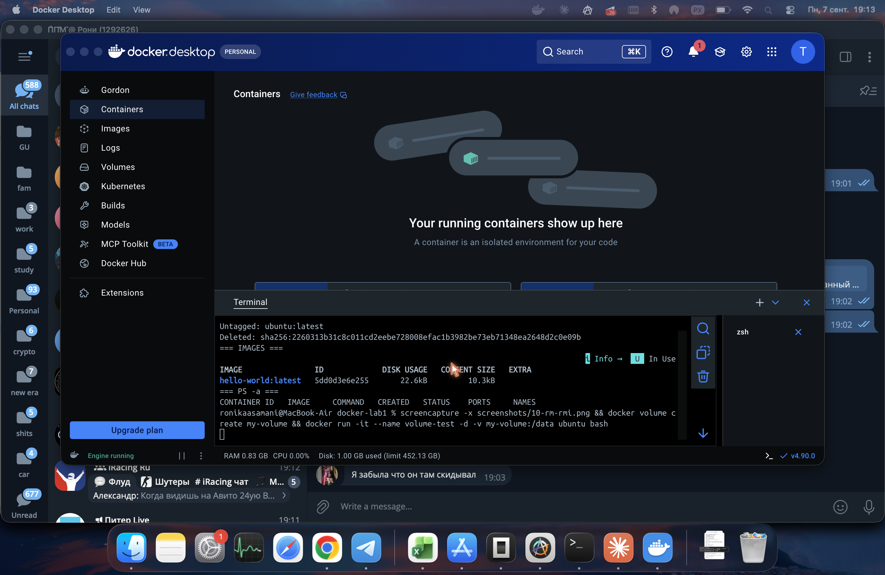

#### 1.5. Работа с томами (volumes)

Тома (volumes) — способ хранения данных, не привязанный к жизненному циклу конкретного контейнера: данные хранятся на хосте в области, управляемой Docker.

```bash
docker volume create my-volume
docker run -it --name volume-test -d -v my-volume:/data ubuntu bash
```

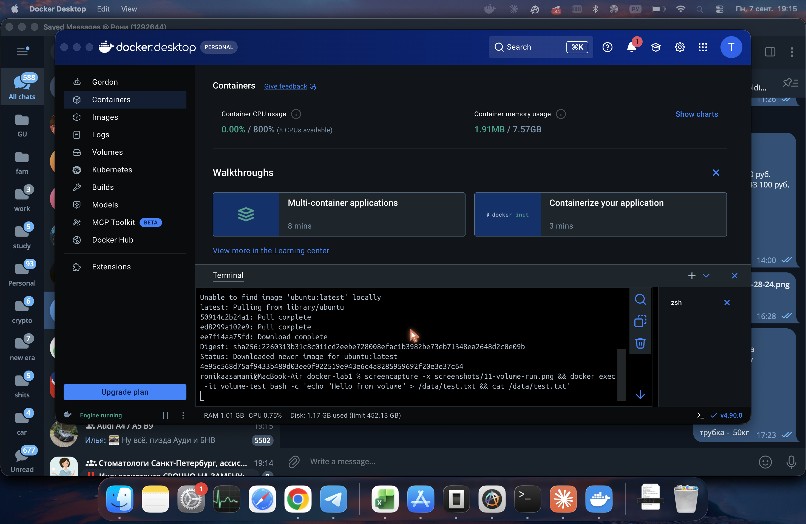

```bash
docker exec -it volume-test bash -c 'echo "Hello from volume" > /data/test.txt && cat /data/test.txt'
```

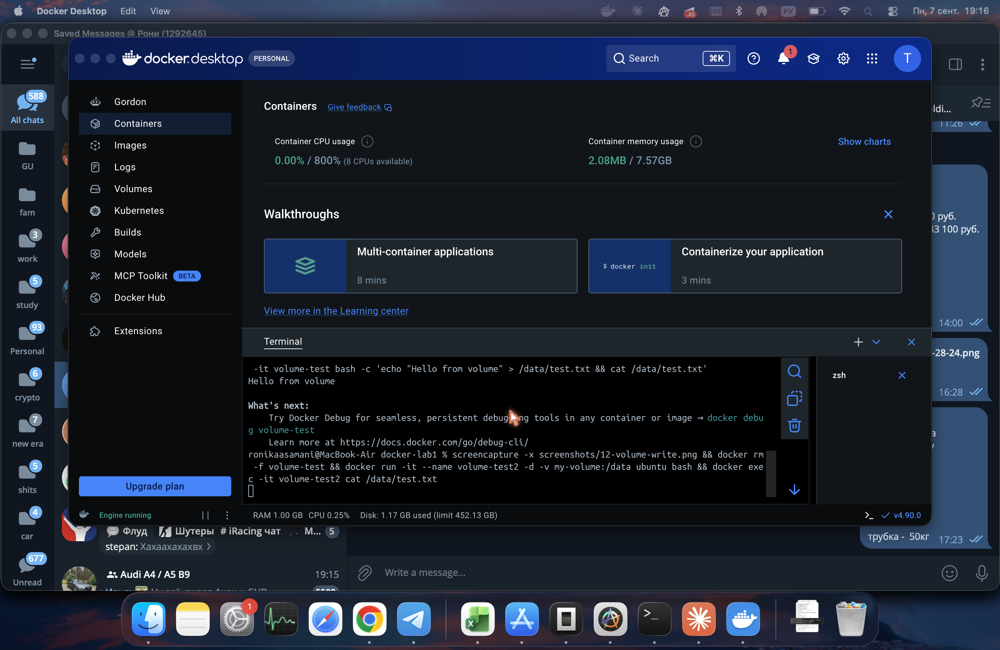

Удаление контейнера и создание нового с тем же томом:

```bash
docker rm -f volume-test
docker run -it --name volume-test2 -d -v my-volume:/data ubuntu bash
docker exec -it volume-test2 cat /data/test.txt
```

Файл `test.txt` сохранился после удаления первого контейнера — данные хранились не в файловой системе контейнера, а в томе `my-volume`, который существует независимо от контейнеров.


### 2. Лабораторная работа со звёздочкой — Dockerfile по заданным условиям

Файлы проекта (`flask-app/`):

`app.py`:
```python
from flask import Flask
app = Flask(__name__)
@app.route('/')
def hello():
    return "Hello from Docker!"
if __name__ == '__main__':
    app.run(host='0.0.0.0', port=5000)
```

`requirements.txt`:
```
Flask==2.0.1
Werkzeug==2.0.3
```

> **Примечание по отладке.** По условию задания требовалось указать в `requirements.txt` только `Flask==2.0.1`. При сборке с одной этой строкой контейнер падал сразу после старта с ошибкой `ImportError: cannot import name 'url_quote' from 'werkzeug.urls'` — pip подтягивал самую свежую версию Werkzeug, несовместимую со старым Flask 2.0.1 (в новых версиях Werkzeug функция `url_quote` была удалена). Решение — явно закрепить совместимую версию `Werkzeug==2.0.3`. Это реальная и распространённая проблема при работе со старыми пакетами Python и хороший пример того, зачем в `requirements.txt` фиксируют версии всех ключевых зависимостей, а не только основной библиотеки.

`Dockerfile`:
```dockerfile
FROM python:3.9-slim
WORKDIR /app
RUN apt-get update && \
    apt-get install -y --no-install-recommends curl vim && \
    rm -rf /var/lib/apt/lists/*
COPY requirements.txt .
RUN pip install --no-cache-dir -r requirements.txt
COPY app.py .
RUN useradd -u 1000 -m appuser && chown -R appuser:appuser /app
USER appuser
EXPOSE 5000
ENV FLASK_ENV=production
CMD ["python", "app.py"]
```

Соответствие требований и инструкций:

| Требование | Инструкция |
|---|---|
| Базовый образ python:3.9-slim | `FROM python:3.9-slim` |
| Рабочая директория /app | `WORKDIR /app` |
| Системные пакеты curl, vim | `RUN apt-get install -y curl vim` |
| Python-зависимости из requirements.txt | `COPY requirements.txt .` + `RUN pip install -r requirements.txt` |
| Копирование app.py | `COPY app.py .` |
| Пользователь appuser с UID 1000 | `RUN useradd -u 1000 -m appuser` |
| Переключение на appuser | `USER appuser` |
| Порт 5000 | `EXPOSE 5000` |
| Переменная FLASK_ENV=production | `ENV FLASK_ENV=production` |
| Запуск приложения | `CMD ["python", "app.py"]` |

Сборка и запуск:

```bash
docker build -t my-flask-app .
```

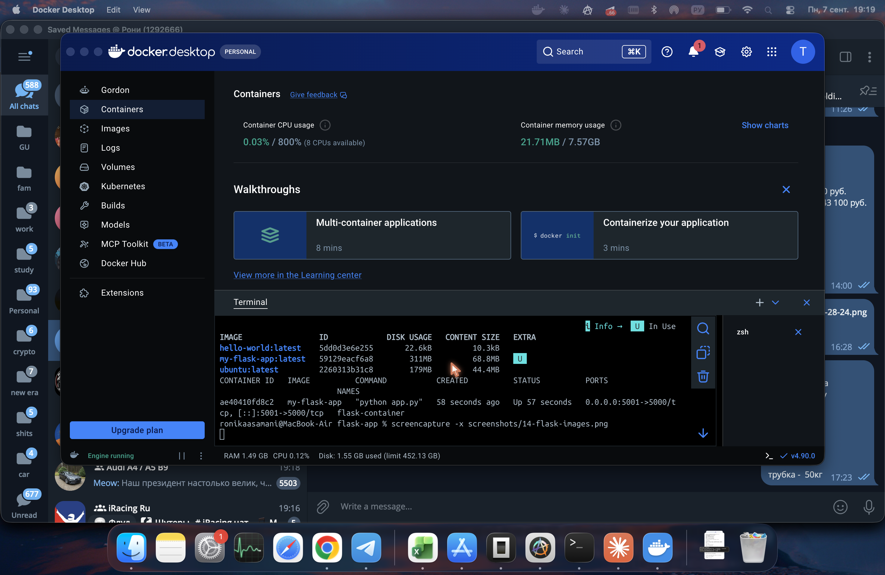

```bash
docker run -d -p 5001:5000 --name flask-container my-flask-app
curl http://localhost:5001
```

> **Примечание.** Стандартный порт `5000:5000` из задания оказался занят на macOS системным процессом AirPlay Receiver (`bind: address already in use`), поэтому наружу проброшен порт `5001` (`-p 5001:5000`) — сам контейнер внутри слушает 5000, как и требуется.

```
Hello from Docker!
```

Проверка, что процесс в контейнере действительно работает от `appuser`, а не от `root`:

```bash
docker exec flask-container whoami
docker exec flask-container id
```

```
appuser
uid=1000(appuser) gid=1000(appuser) groups=1000(appuser)
```

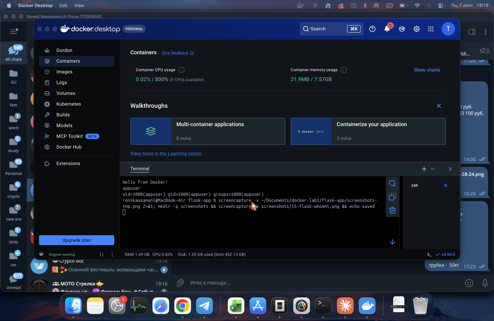

## Результаты и анализ

В ходе работы были на практике изучены и опробованы:
- основные команды жизненного цикла контейнера (`run`, `ps`, `stop`, `start`, `rm`);
- работа с готовыми образами из Docker Hub и их модификация изнутри контейнера (`apt install`);
- проброс портов и запуск изолированного веб-сервера (nginx), включая чтение логов реальных HTTP-запросов;
- механизм томов (volumes) для хранения данных, переживающих удаление контейнера;
- написание Dockerfile «с нуля» по заданным техническим требованиям: выбор базового образа, установка системных и Python-зависимостей, создание непривилегированного пользователя (хорошая практика безопасности — приложение не должно работать от root без необходимости), проброс порта и настройка переменных окружения.

Дополнительно пришлось столкнуться и решить две реальные технические проблемы:
1. **Конфликт версий зависимостей** — `Flask==2.0.1` несовместим с новейшим `Werkzeug`, который подтягивался автоматически; решено явным закреплением версии `Werkzeug==2.0.3`.
2. **Конфликт портов на хосте** — порт 5000 на macOS уже занят системным сервисом AirPlay Receiver; решено пробросом другого порта хоста (5001) при сохранении порта 5000 внутри контейнера, как того требует задание.

## Выводы

Docker позволяет упаковывать приложение вместе со всем окружением (системными и языковыми зависимостями) в переносимый, воспроизводимый и изолированный образ. Это упрощает развёртывание — один и тот же образ гарантированно ведёт себя одинаково на любой машине с установленным Docker, устраняя проблему «у меня работает, а на сервере — нет». Работа с томами решает проблему эфемерности файловой системы контейнера, позволяя сохранять данные между пересозданиями контейнеров. Создание образов по собственному Dockerfile — базовый навык для контейнеризации любого приложения и последующего использования в CI/CD и оркестраторах (Docker Compose, Kubernetes). Отдельно стоит отметить, что даже простая лабораторная работа на практике сталкивается с типичными проблемами реальной разработки — несовместимостью версий зависимостей и конфликтами портов, — и умение их диагностировать (через `docker logs`, сообщения об ошибках) и устранять является такой же частью навыка работы с Docker, как и знание самих команд.

## Полезные ссылки

- [Docker Documentation](https://docs.docker.com/)
- [Docker Hub](https://hub.docker.com/)
- [Docker Commands Reference](https://docs.docker.com/reference/cli/docker/)
- [Docker Images](https://docs.docker.com/reference/cli/docker/image/ls/)
- [Docker Containers](https://docs.docker.com/reference/cli/docker/container/)
- [Правила оформления лабораторных работ](https://github.com/itmo-ict-faculty/introduction-in-web-tech/blob/main/docs/education/labs2025-2026/reportdesign.md)
