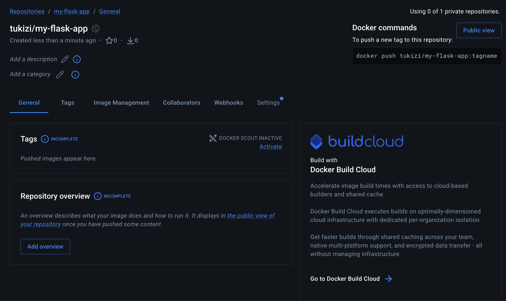
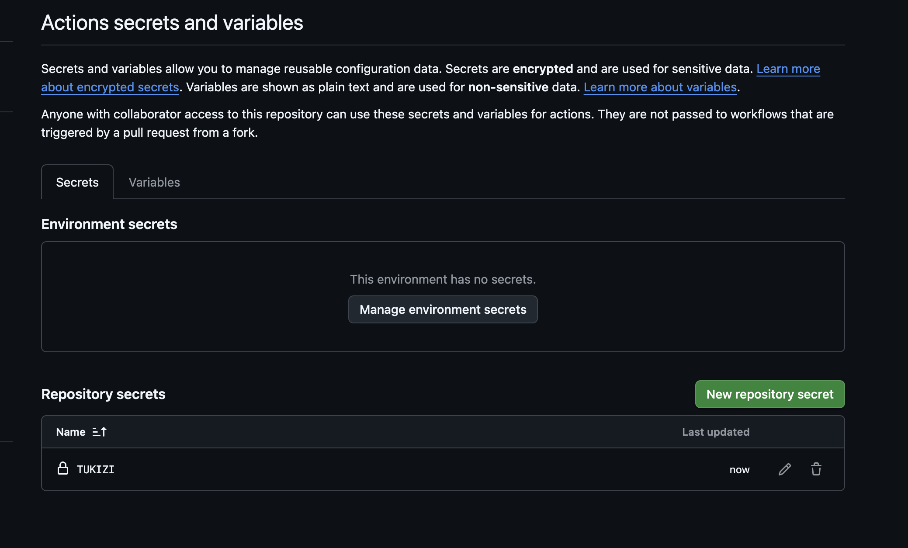
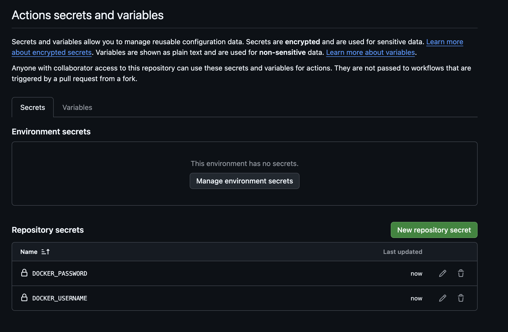
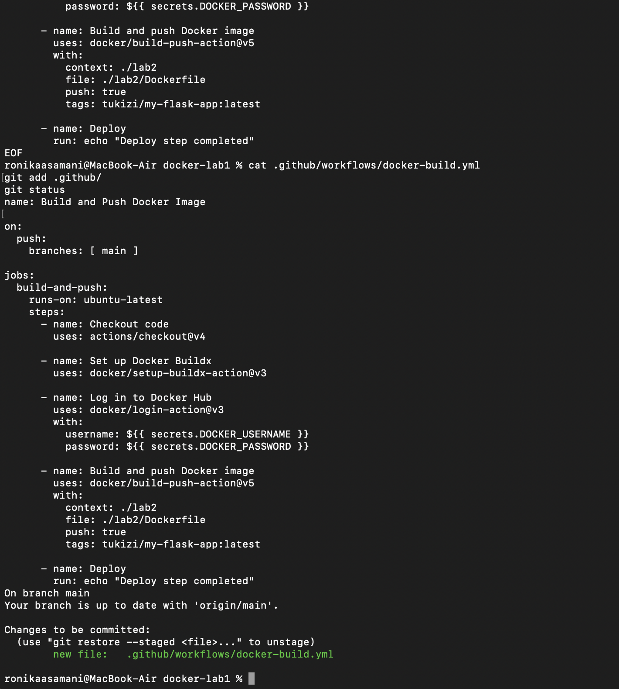
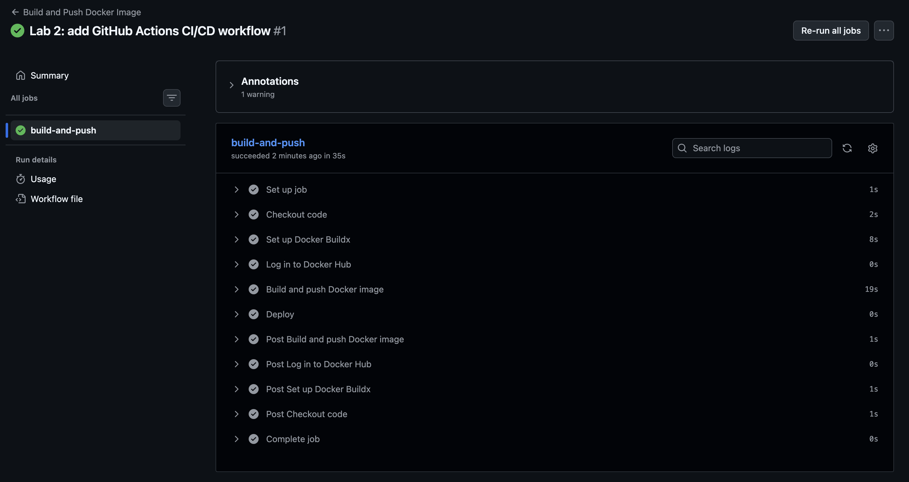
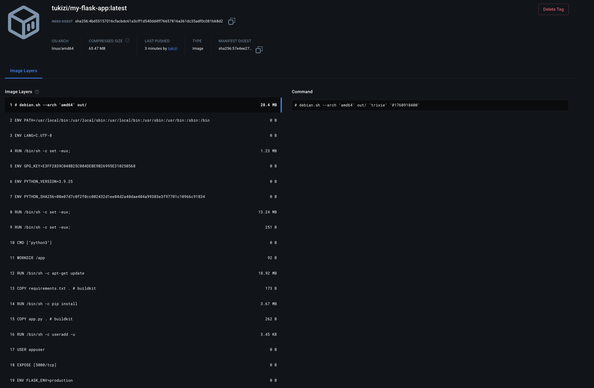

University: [ITMO University](https://itmo.ru/ru/)
Faculty: [FICT](https://fict.itmo.ru)
Course: Введение в веб-технологии
Year: 2025/2026
Group: U4225
Author: Каасамани Рони Бахааевич
Lab: Lab2
Date of create: 14.09.2026
Date of finished: 14.09.2026

# Лабораторная работа №2. CI/CD для Docker-приложения

## Цель работы

Настроить CI/CD-пайплайн GitHub Actions для автоматической сборки Docker-образа Flask-приложения, публикации в Docker Hub и выполнения шага деплоя при изменениях в ветке main.

## 1. Подготовка Docker-приложения

В папку `lab2/` перенесены три файла из первой лабораторной работы:

- `app.py` — приложение Flask, которое на запрос к маршруту `/` возвращает строку `Hello from Docker!`;
- `requirements.txt` — зависимости `Flask==2.0.1` и `Werkzeug==2.0.3`;
- `Dockerfile` — сборка образа на базе `python:3.9-slim`, установка `curl`/`vim`, создание непривилегированного пользователя `appuser` (UID 1000), открытие порта 5000.

Файлы созданы и закоммичены через терминал командой `cat > файл << 'EOF' ... EOF`, без использования текстового редактора.

## 2. Создание репозитория Docker Hub

На Docker Hub создан публичный репозиторий `tukizi/my-flask-app`.

*Рисунок 1 — созданный публичный репозиторий tukizi/my-flask-app перед первой публикацией образа.*

## 3. Настройка секретов GitHub

В настройках репозитория (`Settings → Secrets and variables → Actions`) добавлены секреты для авторизации в Docker Hub: `DOCKER_USERNAME` (логин Docker Hub) и `DOCKER_PASSWORD` (Personal Access Token с правами Read & Write).

**Возникшая сложность.** При создании первого секрета значение (`tukizi`) было случайно введено в поле **Name** вместо поля **Value** — в результате в списке секретов появилась запись с именем `TUKIZI` вместо `DOCKER_USERNAME`.

*Рисунок 2a — секрет по ошибке создан с именем TUKIZI вместо DOCKER_USERNAME.*

**Решение.** Неверный секрет удалён, оба секрета созданы заново с правильным распределением полей Name/Value.

*Рисунок 2b — секреты DOCKER_USERNAME и DOCKER_PASSWORD, значения скрыты GitHub автоматически.*

Значения секретов нигде не хранятся в коде и не отображаются в отчёте.

## 4. Настройка GitHub Actions

В репозитории создан workflow `.github/workflows/docker-build.yml`, запускающийся при каждом push в ветку `main` на раннере `ubuntu-latest`:

1. Checkout кода репозитория (`actions/checkout@v4`);
2. Настройка Docker Buildx (`docker/setup-buildx-action@v3`);
3. Авторизация в Docker Hub через `DOCKER_USERNAME`/`DOCKER_PASSWORD` (`docker/login-action@v3`);
4. Сборка образа из контекста `./lab2` и `./lab2/Dockerfile`;
5. Публикация образа с тегом `tukizi/my-flask-app:latest` (`docker/build-push-action@v5`);
6. Шаг деплоя — вывод сообщения `Deploy step completed`.

*Рисунок 3 — созданный docker-build.yml и подтверждение git status перед коммитом.*

## 5. Тестирование pipeline

После push файла workflow в ветку `main` GitHub Actions автоматически запустил pipeline «Build and Push Docker Image». Запуск завершился успешно с первой попытки за 39 секунд — все шаги (Checkout code, Set up Docker Buildx, Log in to Docker Hub, Build and push Docker image, Deploy) получили статус success.

*Рисунок 4 — детальный лог успешного запуска workflow, все 6 шагов job build-and-push завершены с галочкой.*

Единственное замечание в логе — предупреждение о том, что используемые версии GitHub Actions (`actions/checkout@v4`, `docker/build-push-action@v5`) ориентированы на устаревший Node.js 20 и принудительно выполняются на Node.js 24. Это предупреждение от самих сторонних actions, на работу pipeline оно не повлияло.

## 6. Проверка публикации образа

В репозитории `tukizi/my-flask-app` на Docker Hub появился образ с тегом `latest` (65.47 MB, платформа linux/amd64), время публикации совпадает со временем успешного запуска Actions.

*Рисунок 5 — образ tukizi/my-flask-app:latest со слоями сборки на Docker Hub.*

## Результат

В ходе работы:

- перенесены файлы Flask-приложения из lab1 в папку lab2;
- создан публичный репозиторий на Docker Hub;
- настроены секреты GitHub Actions для авторизации в Docker Hub (с исправлением реальной ошибки при их создании);
- создан workflow GitHub Actions, автоматически собирающий и публикующий Docker-образ при push в main;
- pipeline успешно протестирован — образ опубликован в Docker Hub с тегом latest.

## Вывод

В ходе лабораторной работы настроен полноценный CI/CD-пайплайн на GitHub Actions: при каждом push в ветку main автоматически выполняются checkout кода, сборка Docker-образа через Buildx, авторизация в Docker Hub по секретам репозитория, публикация образа с тегом latest и условный шаг деплоя. Практика с секретами показала важность внимательности при заполнении полей Name/Value — перепутанные местами значения не были бы заметны сразу, если бы GitHub не показал явно неверное имя секрета в списке. Успешное прохождение pipeline и появление образа в Docker Hub подтверждают корректность настройки.
