University: [ITMO University](https://itmo.ru/ru/)
Faculty: [FICT](https://fict.itmo.ru)
Course: Введение в веб-технологии
Year: 2025/2026
Group: U4225
Author: Каасамани Рони Бахааевич
Lab: Lab3
Date of create: 14.09.2026
Date of finished: 15.09.2026

# Лабораторная работа №3. Мониторинг с Prometheus и Grafana

## Цель работы

Развернуть стек мониторинга (Node Exporter, Prometheus, Grafana) в отдельной Docker-сети, настроить сбор системных метрик хоста и построить дашборд с панелями использования CPU, памяти и диска.

## 1. Подготовка конфигурации Prometheus

Создана папка `lab3/prometheus/` и конфигурационный файл `prometheus.yml`:

```yaml
global:
  scrape_interval: 15s

scrape_configs:
  - job_name: 'prometheus'
    static_configs:
      - targets: ['localhost:9090']

  - job_name: 'node-exporter'
    static_configs:
      - targets: ['node-exporter:9100']
```

Файл создан через терминал командой `cat > prometheus.yml << 'EOF' ... EOF`, без использования текстового редактора, и добавлен в git (`git add lab3/`).

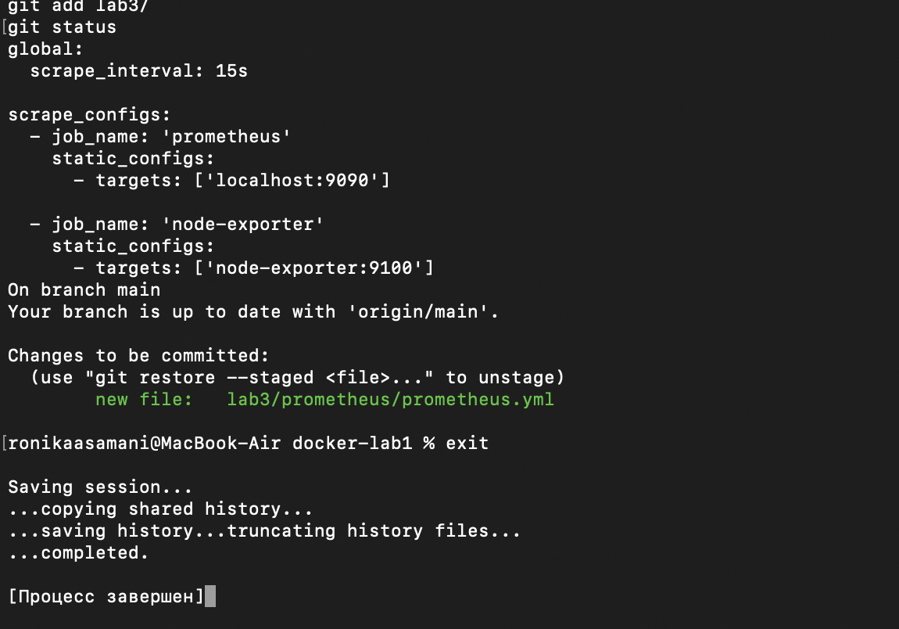
*Рисунок 1 — содержимое prometheus.yml и git status, подтверждающий staged-файл.*

## 2. Docker-сеть и Node Exporter

Создана отдельная Docker-сеть `monitoring` для взаимодействия контейнеров по именам:

```bash
docker network create monitoring
```

Запущен Node Exporter для сбора системных метрик хоста:

```bash
docker run -d \
  --name node-exporter \
  --network monitoring \
  -p 9100:9100 \
  -v /proc:/host/proc:ro \
  -v /sys:/host/sys:ro \
  -v /:/rootfs:ro \
  --pid="host" \
  prom/node-exporter \
  --path.procfs=/host/proc \
  --path.sysfs=/host/sys \
  --collector.filesystem.mount-points-exclude='^/(sys|proc|dev|host|etc)($$|/)'
```

Проверка через `docker ps` и `curl http://localhost:9100/metrics` подтвердила работу экспортёра — вернулись реальные метрики (`go_gc_duration_seconds`, `go_goroutines` и т.д.).

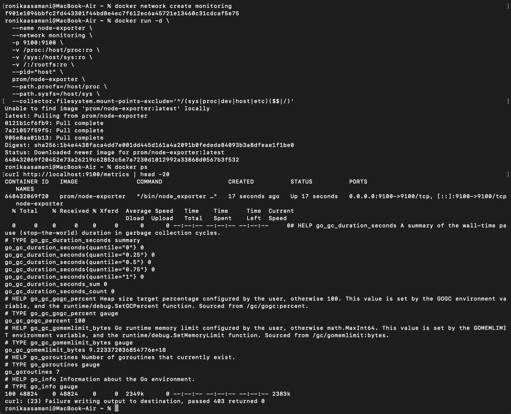
*Рисунок 2 — создание сети, запуск node-exporter, docker ps и curl.*

## 3. Тома и запуск Prometheus

Созданы именованные тома для персистентности данных:

```bash
docker volume create prometheus-data
docker volume create grafana-data
```

**Возникшая сложность.** Первая попытка запуска Prometheus с монтированием конфигурационного файла:

```bash
docker run -d \
  --name prometheus \
  --network monitoring \
  -p 9090:9090 \
  -v prometheus-data:/prometheus \
  -v "$(pwd)/lab3/prometheus/prometheus.yml:/etc/prometheus/prometheus.yml" \
  prom/prometheus \
  --config.file=/etc/prometheus/prometheus.yml
```

завершилась ошибкой `error mounting "...": not a directory: Are you trying to mount a directory onto a file?`. Причина — команда была выполнена не из папки репозитория, а из домашней директории (`~`), поэтому `$(pwd)/lab3/...` указывал на несуществующий путь, и Docker вместо файла попытался примонтировать пустую директорию.

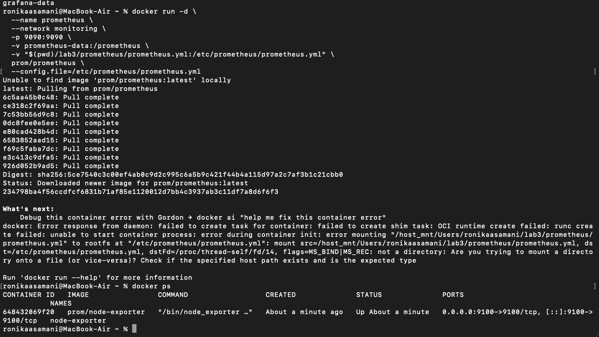
*Рисунок 3a — неудачный запуск Prometheus, docker ps показывает только node-exporter.*

**Решение.** Файл найден командой `find ~ -maxdepth 4 -iname "prometheus.yml"` — обнаружены два файла: случайно созданный в домашней папке дубликат и корректный файл в репозитории.

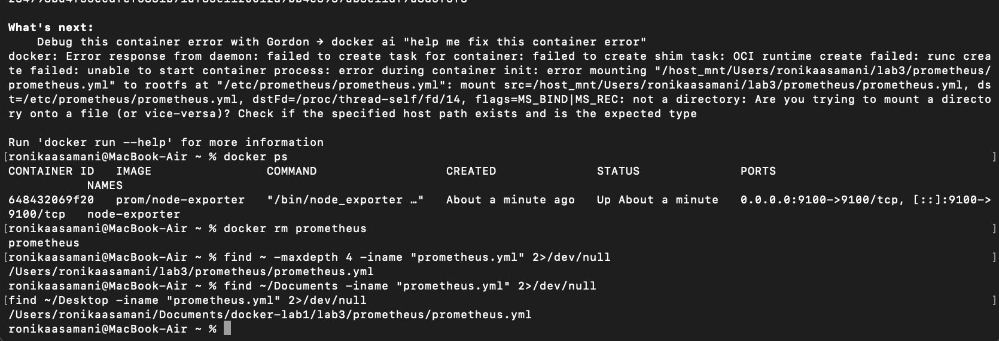
*Рисунок 3b — find обнаружил корректный путь к prometheus.yml в папке репозитория.*

После перехода в папку репозитория (`cd ~/Documents/docker-lab1`) команда запуска Prometheus выполнена успешно, `docker ps` показал оба контейнера (node-exporter, prometheus) в статусе Up.

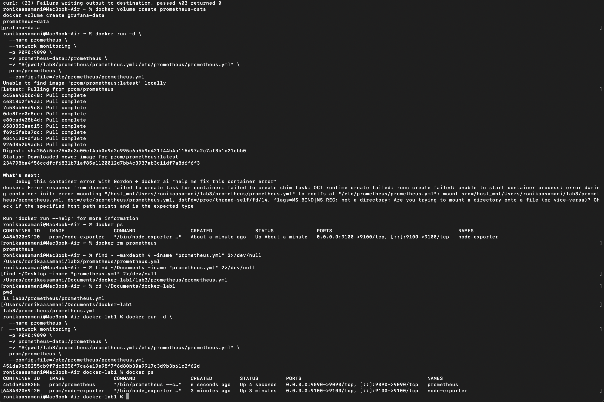
*Рисунок 3c — pwd, ls, повторный docker run и docker ps с двумя работающими контейнерами.*

## 4. Проверка целей в Prometheus и запуск Grafana

В веб-интерфейсе Prometheus (`http://localhost:9090/targets`) обе цели — `prometheus` и `node-exporter` — отображаются в статусе **UP**.

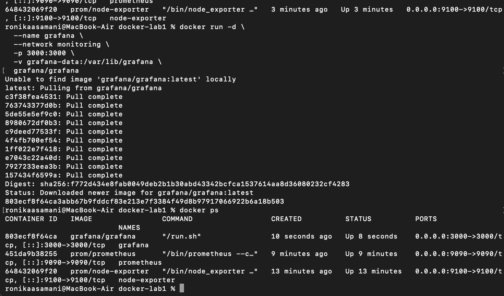
*Рисунок 4 — Status → Target health, обе цели зелёные (UP).*

Запущена Grafana с персистентным томом:

```bash
docker run -d \
  --name grafana \
  --network monitoring \
  -p 3000:3000 \
  -v grafana-data:/var/lib/grafana \
  grafana/grafana
```

`docker ps` подтвердил три работающих контейнера: node-exporter, prometheus, grafana.

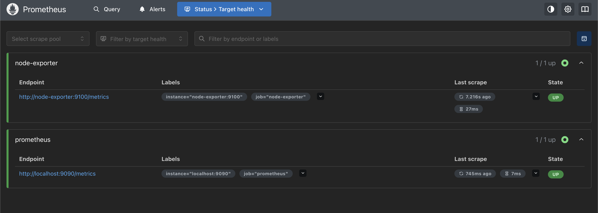
*Рисунок 5 — node-exporter, prometheus и grafana в статусе Up.*

Вход в Grafana выполнен по адресу `http://localhost:3000` с логином/паролем `admin`/`admin`.

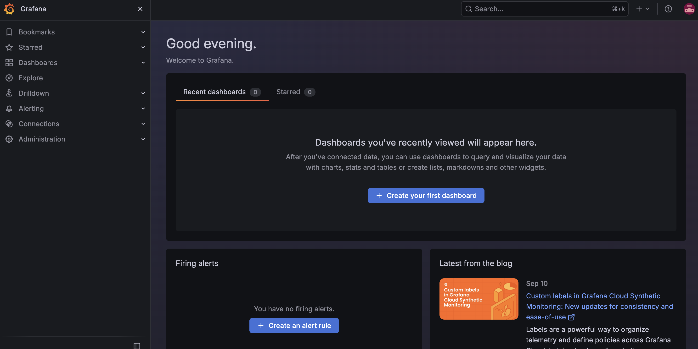
*Рисунок 6 — приветственный экран Grafana.*

## 5. Подключение Prometheus как источника данных

В разделе **Connections → Data sources** добавлен источник данных Prometheus с URL `http://prometheus:9090` (обращение по имени контейнера внутри Docker-сети `monitoring`). Проверка **Save & test** вернула успешный результат.


*Рисунок 7 — "Successfully queried the Prometheus API".*

## 6. Построение дашборда

Создан новый дашборд с тремя панелями на основе PromQL-запросов:

**CPU Usage:**
```
100 - (avg by (instance) (rate(node_cpu_seconds_total{mode="idle"}[5m])) * 100)
```

**Memory Usage:**
```
(1 - (node_memory_MemAvailable_bytes / node_memory_MemTotal_bytes)) * 100
```

**Disk Usage** (первая версия):
```
100 - ((node_filesystem_avail_bytes{mountpoint="/"} / node_filesystem_size_bytes{mountpoint="/"}) * 100)
```

**Возникшая сложность.** Панель Disk Usage не показывала данные — точки монтирования `mountpoint="/"` не существовало у метрики `node_filesystem_size_bytes`. Через **Metrics browser** выяснилось, что у node-exporter доступны только `mountpoint` вида `/tmp` и `/var` — то есть экспортёр видел файловую систему **самого контейнера**, а не хоста, так как контейнер был запущен без флага `--path.rootfs`.

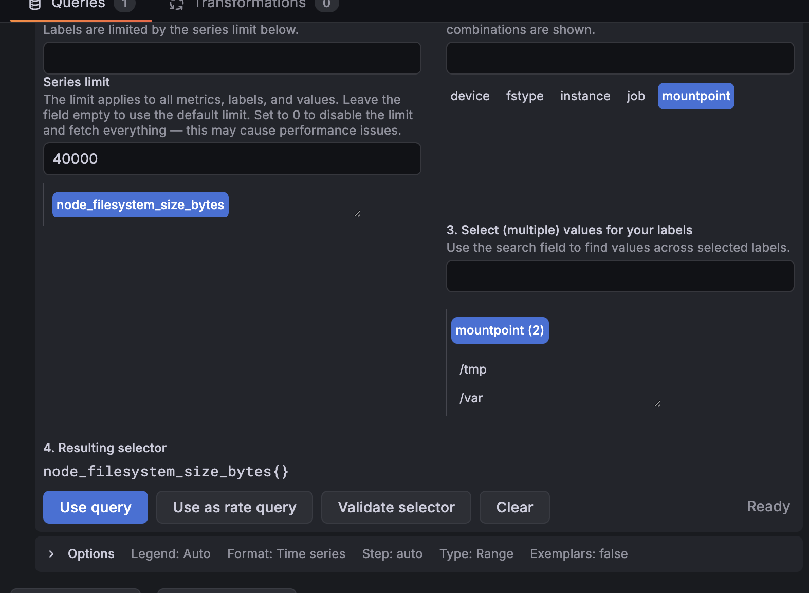
*Рисунок 8a — Metrics browser, список mountpoint ограничен внутренней ФС контейнера.*

**Решение (часть 1).** Контейнер node-exporter пересоздан с дополнительным флагом `--path.rootfs=/rootfs`, указывающим на примонтированный корень хоста:

```bash
docker rm -f node-exporter
docker run -d \
  --name node-exporter \
  --network monitoring \
  -p 9100:9100 \
  -v /proc:/host/proc:ro \
  -v /sys:/host/sys:ro \
  -v /:/rootfs:ro \
  --pid="host" \
  prom/node-exporter \
  --path.procfs=/host/proc \
  --path.sysfs=/host/sys \
  --path.rootfs=/rootfs \
  --collector.filesystem.mount-points-exclude='^/(sys|proc|dev|host|etc)($$|/)'
```

После пересоздания список `mountpoint` расширился до 16 значений, включая `/host_mnt`, `/host_mnt/Users` и другие — это точки монтирования лёгкой Linux-VM, в которой Docker Desktop для macOS исполняет контейнеры (реальный диск Mac проксируется через gRPC-FUSE/virtiofs под именем `/host_mnt`).

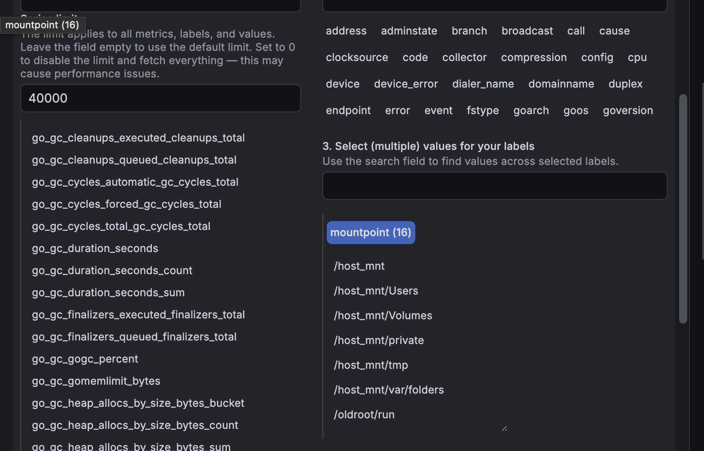
*Рисунок 8b — 16 доступных mountpoint, включая /host_mnt и его подпапки.*

**Решение (часть 2).** Точка `mountpoint="/host_mnt"` оказалась виртуальной прослойкой с нулевой занятостью (проверено через Table view — во всех точках значение `0`):

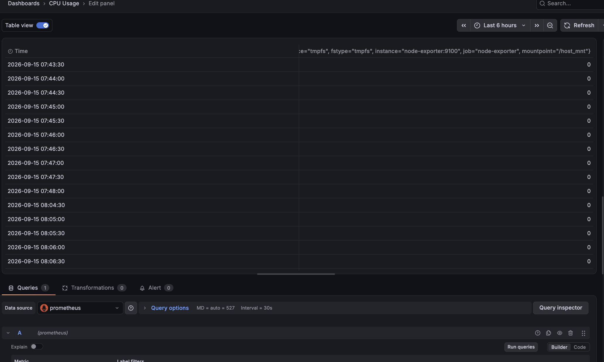
*Рисунок 8c — числовые значения запроса по /host_mnt равны нулю.*

Обновлён `docker run` для node-exporter (финальная версия с `--path.rootfs`), что подтверждено через `docker ps`:

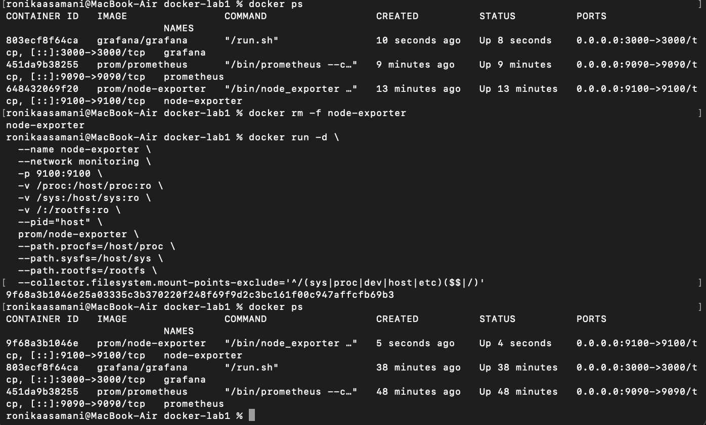
*Рисунок 8d — терминал: docker rm, повторный docker run с --path.rootfs=/rootfs, docker ps.*

Запрос панели Disk Usage изменён на точку `/host_mnt/Users` (реальная примонтированная домашняя папка пользователя, тип `virtiofs`):

```
100 - ((node_filesystem_avail_bytes{mountpoint="/host_mnt/Users"} / node_filesystem_size_bytes{mountpoint="/host_mnt/Users"}) * 100)
```

После этого панель начала отображать реальные данные — занятость диска около 95% с живой динамикой.

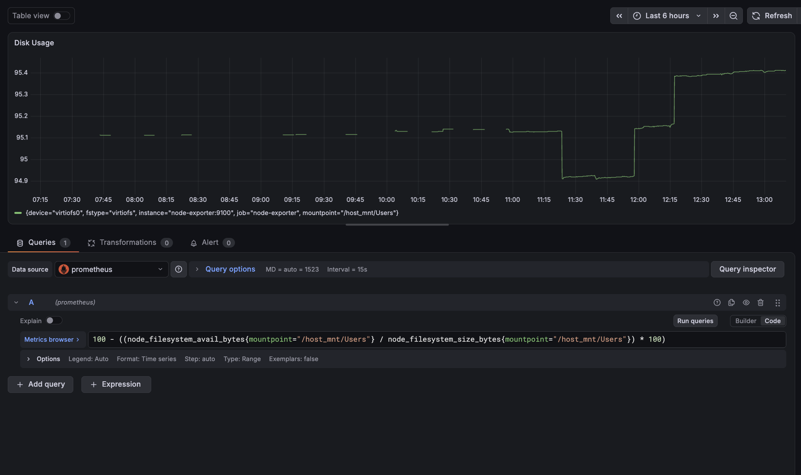
*Рисунок 8e — рабочий график занятости диска (~95%), device="virtiofs0", fstype="virtiofs".*

## 7. Итоговый дашборд

Собран дашборд с тремя рабочими панелями — CPU Usage, Memory Usage, Disk Usage — на основе реальных метрик Node Exporter.

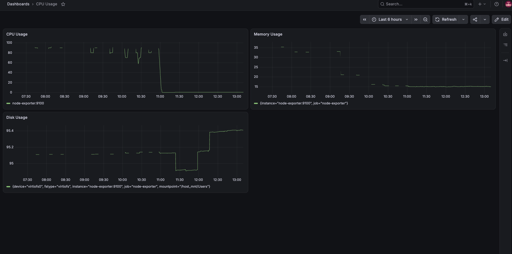
*Рисунок 9 — готовый дашборд мониторинга с живыми данными по CPU, памяти и диску.*

## Результат

В ходе работы:

- создана отдельная Docker-сеть `monitoring` для взаимодействия контейнеров мониторинга по именам;
- настроен и запущен Node Exporter для сбора системных метрик хоста;
- настроен и запущен Prometheus с персистентным томом и конфигурацией scrape-заданий (с исправлением реальной ошибки монтирования конфига из-за неверной рабочей директории);
- подтверждён сбор метрик через Status → Target health (обе цели UP);
- запущена Grafana с персистентным томом, подключён Prometheus как источник данных;
- построен дашборд с тремя панелями (CPU/Memory/Disk Usage) на основе PromQL-запросов, с исправлением реальной сложности — экспортёр изначально не имел доступа к файловой системе хоста из-за отсутствия флага `--path.rootfs`, а также из-за особенностей проксирования диска в Docker Desktop для macOS через `/host_mnt`.

## Вывод

В ходе лабораторной работы развёрнут полноценный стек мониторинга Docker-инфраструктуры на базе Prometheus и Grafana: Node Exporter собирает системные метрики хоста, Prometheus опрашивает их по расписанию и хранит в своей базе, а Grafana визуализирует данные через дашборд с панелями CPU/Memory/Disk. Практика показала важность правильной рабочей директории при монтировании файлов в контейнеры и продемонстрировала особенности сбора метрик хоста в контейнеризированной среде — как в части флага `--path.rootfs` для самого node-exporter, так и в части архитектуры Docker Desktop для macOS, где реальный диск компьютера доступен контейнерам только через виртуализованную прослойку `/host_mnt`.
